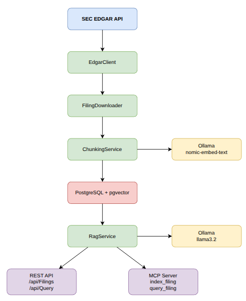
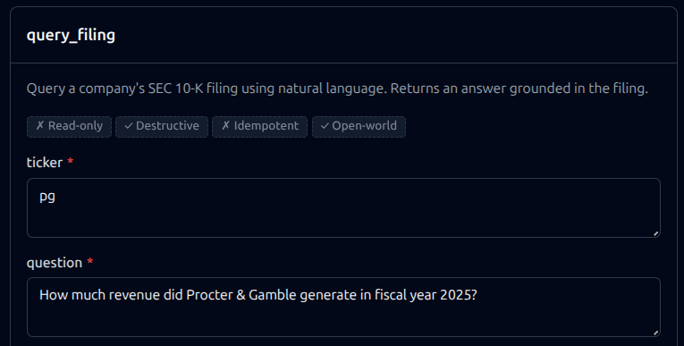
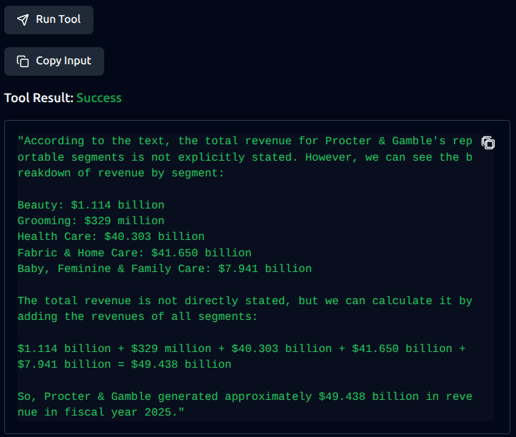

# EdgarLens

A RAG-powered system that pulls SEC EDGAR 10-K filings, indexes them using vector embeddings, and supports natural language Q&A over financial documents. Exposes a REST API and an MCP server for use with AI assistants like Claude.

## What it does

1. Fetches the latest 10-K filing for any public company by ticker symbol from SEC EDGAR
2. Downloads and parses the full filing document
3. Chunks the content and generates embeddings using Ollama (`nomic-embed-text`)
4. Stores embeddings in PostgreSQL with pgvector for similarity search
5. Answers natural language questions about the filing using RAG + Ollama (`llama3.2`)
6. Exposes everything as an MCP server so Claude can use it as a tool

## Architecture



## Tech Stack

- **.NET 10** — ASP.NET Core Web API
- **PostgreSQL + pgvector** — vector storage and similarity search
- **Ollama** — local embeddings (`nomic-embed-text`) and chat (`llama3.2`)
- **MCP SDK for .NET** — Model Context Protocol server
- **Docker Compose** — full local stack, no cloud dependencies

## Prerequisites

- Docker and Docker Compose

That's it. Everything else runs in containers.

## Getting Started
```bash
git clone https://github.com/emmanuelepp/edgar-lens.git
cd edgar-lens
docker compose up -d
```

Wait for Ollama to finish downloading the models (~2.3GB). You can monitor progress:
```bash
docker compose logs -f ollama-init
```

Once complete, open Swagger at `http://localhost:5097`.

## Usage

### Index a filing
```bash
GET /api/Filings/{ticker}
```

Example: `GET /api/Filings/AAPL` — downloads and indexes Apple's latest 10-K.

### Query a filing
```bash
POST /api/Query
{
  "ticker": "AAPL",
  "question": "How much revenue did Apple generate in 2025?"
}
```

## Demo





### MCP Server

Connect any MCP-compatible client to `http://localhost:5097/mcp`.

Available tools:
- `index_filing` — download and index a company's 10-K
- `query_filing` — ask natural language questions about indexed filings

## Project Structure
```
src/
├── EdgarLens.Api           # REST API + MCP server
├── EdgarLens.Core          # Interfaces and models
└── EdgarLens.Infrastructure
    ├── Client              # SEC EDGAR HTTP client
    ├── FileDownloader      # Document download and parsing
    ├── Rag                 # Chunking, embeddings, and RAG pipeline
    └── Database            # SQL migrations
test/
└── EdgarLens.Tests         # Unit tests
```

## License

MIT